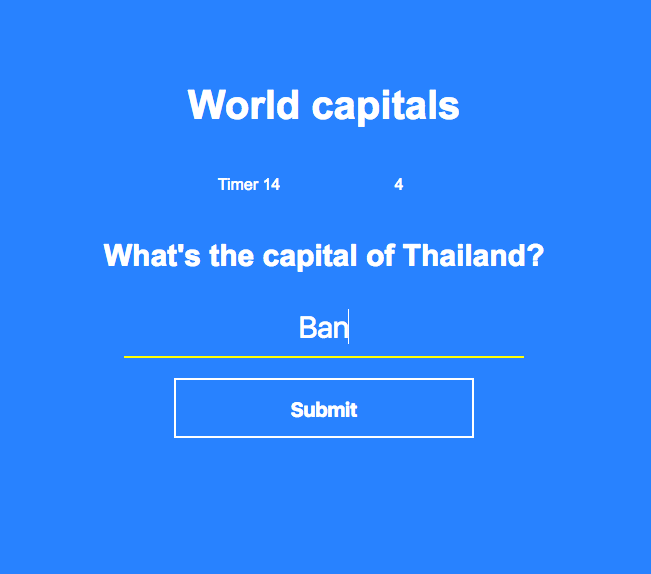

# wdi-project-1
My first project for WDI London:

#Introduction

I had two aims for my first project. Firstly I wanted to practice and build upon what I’ve learnt with HTML, CSS and JavaScript in the first two weeks of my WDI course. Secondly, I wanted to create a cool and clean game that could test users’ knowledge of the world's capital cities. 

#How to play

When you load the page you'll be prompted to click the start button. Immediately after clicking the start button you’ll be asked the capital city of a randomly selected country and the race against the clock begins. You'll score a point for each question you answer correctly and the goal is to score as many points as possible in a minute. 

#Credits

A big thanks to Alex, Rane, Ed and Nat for their guidance and advice. 